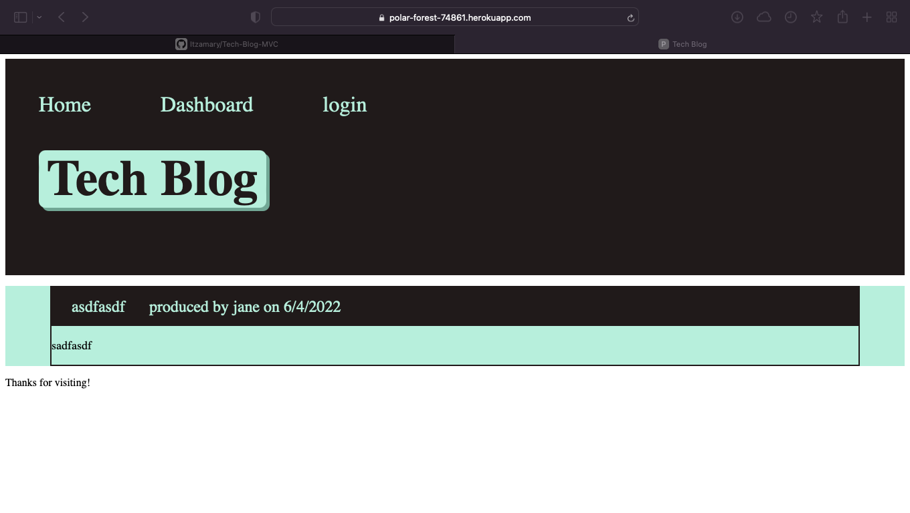

# Tech-Blog-MVC

## Purpose
This is a blog site that a user can view general information from but can not post, comment or edit the post or comments, you can log in as a user aser and then create your own post and comment on other user posts. you can also edit or delete your comments or posts and when your all done you can log out. also this app has a 2 minute cookie max limit so if you are inactive after that set time you will have to log back in.

## Built With
* Javascript
* Node.js
* Sequelize.js
* mysql2
* express handlebars.js
* css3

## GitHub Repository
https://github.com/Itzamary/Tech-Blog-MVC

## Heroku link
https://polar-forest-74861.herokuapp.com

## Website Image
